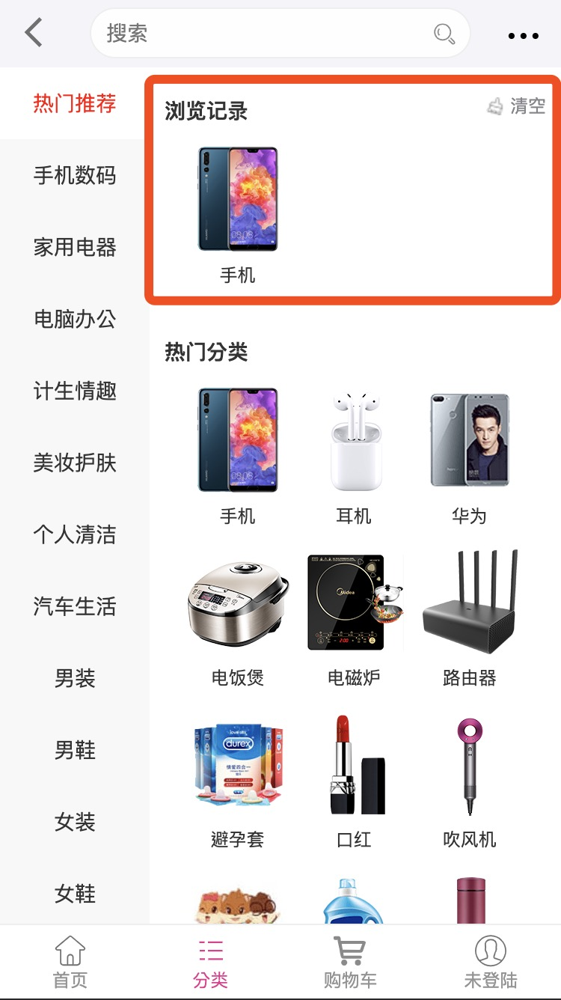

# 淘商城移动端购物网站
+    前言：本项目纯属个人开源作品如有侵权请联系` 15820330954@163.com` 谢谢～～！😅
+ 项目简单介绍： 前端ui框架使用了`Ant-Design Mobile` 后端使用的是` node` 数据库使用了`mysql`

##技术栈：
+ react
+ react-router
+ redux 
+ node
+ mysql
+ sass
+ Ant-Design Mobile

## 网站的构成：
+ 首页
+ 分类
+ 列表
+ 商品详情页
+ 购物车
+ 登陆注册
+ 账号管理

## 功能介绍：
### 首页：
+  秒杀部分使用了每两小时倒计时


   ``` javascript
	// 倒计时
	getTimes = () => {
        let oDate = new Date()
        let date2 = null
        if (oDate.getHours() % 2 === 0) {
            date2 = new Date(oDate.getFullYear(), oDate.getMonth(), oDate.getDate(), oDate.getHours() + 2, 0, 0)
        } else {
            date2 = new Date(oDate.getFullYear(), oDate.getMonth(), oDate.getDate(), oDate.getHours() + 1, 0, 0)
        }
        let chazhi = date2 - oDate

        let s = parseInt(chazhi / 1000 % 60)
        let m = parseInt(chazhi / 1000 / 60 % 60)
        let h = parseInt(chazhi / 1000 / 60 / 60 % 24)
        let hour = `0${h}`
        let minute = m > 9 ? m : `0${m}`
        let second = s > 9 ? s : `0${s}`
        // console.log(hour, minute, second)

        this.setState({
            hour,
            minute,
            second
        })
    }
   ```
   
### 分类:
+ 分类中点击选项自动获取浏览记录



- 实现代码👇

``` javascript
 	 // 加入浏览记录
     lljl = (item) => {
        if (window.localStorage.lljlarr) {
            var array = JSON.parse(window.localStorage.lljlarr)
        } else {
            array = []
        }

        for (let i = 0; i < array.length; i++) {
            if (item.id === array[i].id) {
                return
            }
        }
        let obj = item
        array.push(obj)
        window.localStorage.lljlarr = JSON.stringify(array)
    }

```

### 列表页：
+ 列表页主要功能：点击切换显示排序样式👇

 

- 实现代码：

```  javascript
// 切换样式
bott = () => {
  let {css} = this.state
  if (css === list) {
    this.setState({
      css: listcs
    })
  } else {
    this.setState({
      css: list
  })
 }
}

```

### 商品详情页：
+ 商品sku点击渲染不同数据：
  
 
 - 加入购物车使用了`redux` 代码实现：

 ``` javascript
 //  加入购物车
 addshopping = (item) => {
        console.log(item)
        let shopping = window.$store.getState()
        if (!shopping) {
            window.$store.dispatch(addshopping(item))
            this.setState({
                gwclength: 1
            })
        } else {
            let arr = []
            for (let i = 0; i < shopping.length; i++) {
                arr.push(shopping[i].id)
            }

            if (arr.includes(item.id)) {
                const index = shopping.findIndex((el) => {
                    return el.id === item.id
                })
                shopping[index].sum += this.state.sum
            } else {
                window.$store.dispatch(addshopping(item))
            }
        }
        if (shopping) {
            this.setState({
                gwclength: shopping.length
            })
        }
        if (window.location.hash.split("/")[1] === 'content') {
            this.refs.addsum.style.display = "block"
            setTimeout(() => {
                this.refs.addsum.style.opacity = '1'
                this.refs.addsum.style.top = "-25px"
                setTimeout(() => {
                    this.refs.addsum.style.opacity = '0'
                }, 900)
                setTimeout(() => {
                    this.refs.addsum.style.top = "-10px"
                    this.refs.addsum.style.display = "none"
                }, 900)
            }, 200)
        }
    }
 ```
 
### 登陆注册:
+ 登陆注册使用了`node` `mysql`：
+ mysql：


+ node代码实现：

```  javascript 
const mysql = require('mysql')
const http = require('http')
const url = require('url')

const connection = mysql.createConnection({
    host: 'localhost',
    user: 'root',
    password: '***',
    database: 'tsc.com'
})
connection.connect()

// 登陆
const login = () => new Promise(resolve => {
    connection.query('select * from user', (error, data) => {
        if (error) {
            throw error
        }
        resolve(data)
    })
})

// 查询
const sele = (name) => new Promise(resolve => {
    let arr = JSON.parse(name)
    connection.query('select * from user where user=?', [arr.username], (error, data) => {
        if (error) {
            resolve(error)
        }
        resolve(data)
    })
})

// 注册
const reg = (name) => new Promise(resolve => {
    let arr = JSON.parse(name)
    connection.query('insert into user value (?,?,?,?,?)', [0, arr.name, arr.username, arr.password, arr.phone], (error, data) => {
        if (error) {
            throw error
        }
        resolve(data)
    })
})

// 修改密码
const changepassword = (name) => new Promise(resolve => {
    let arr = JSON.parse(name)
    connection.query('update user set password=? where user=?', [arr.password, arr.newuser], (error, data) => {
        if (error) {
            throw error
        }
        resolve(data)
    })
})

const server = http.createServer((req, res) => {
    if (req.url === "/favicon.ico") {
        return
    }
    res.writeHead(200, {'Content-Type': 'text/plain; charset=utf8', 'Access-Control-Allow-Origin': "*"});
    let urlString = req.url;
    let url1 = url.parse(urlString, true);
    // console.log(url1);
    let loginName = url1.pathname;

    if (loginName === '/login') {
        login().then(
            value => {
                res.end(JSON.stringify(value));
            })
    } else if (loginName === '/reg') {
        reg(url1.query.name)
            .then(value => {
                res.end(JSON.stringify(value))
            })
    } else if (loginName == '/sele') {
        sele(url1.query.name)
            .then(value => {
                res.end(JSON.stringify(value))
            })
    } else if (loginName == '/changepassword') {
        changepassword(url1.query.name)
            .then(value => {
                res.end(JSON.stringify(value))
            })
    }
})

server.listen(1217)

```
